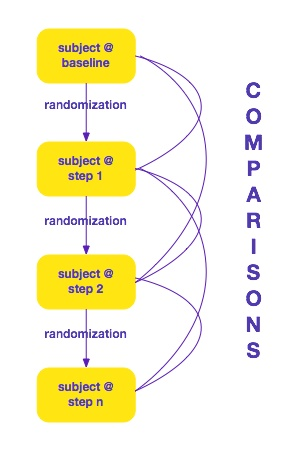
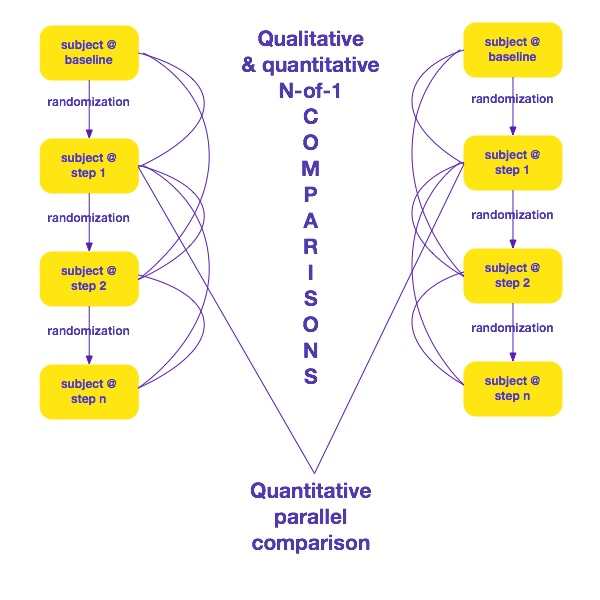

# N-of-1 Triaxial Design in Education Technology Experiments - reviewing concepts, disbanding myths and proposing an enhancement in the conceptualization of the N-of-1 design

The International Consortium for Research and Technology in Personalized Lifelong Learning - for a full list of participants please see note at the end of this manuscript

## Abstract
N-of-1 trials constitute a special type of cross-over trial designs where subjects are individually randomized rather than randomized as part of a group or arm. While this design has a number of advantages over parallel designs, it has been substantially under-utilized in education research due to (1) a lack of knowledge about its principles, as well as (2) a misconception about experiments in education necessarily having carryover effects that will prevent the use of N-of-1. In this article we address both issues, first providing a review of the N-of-1 design in the context of education, and second by addressing the myth that educational trials necessarily imply the presence of carryover effects. We then propose what is, to our knowledge, a novel manner of conceptualizing N-of-1 trial design in education.

## Introduction
N-of-1 trials are cross-over trials where the randomization is conducted at the subject rather than the group level. This modification has a number of important implications. First, data from individual subjects can be analyzed on their own - subjects are their own control, often times improving statistical power and reducing the final study sample size <!-- ref -->. Second, when putting together data from multiple N-of-1 trials, the synthesis is made following meta-analysis principles. Third, similar to cross-over trials, the design will have to carefully consider issues such as carry-over effect, period effects and  intra-subject correlation. And last, since N-of-1 trials are randomized controlled trials, most of the principles applicable to parallel trials also apply to N-of-1, modified versions of the [CONSORT (Consolidated Standards of Reporting Trials) statement](http://www.consort-statement.org/) being applicable.

Although this design has a number of potential applications within educational trials, particularlly among Personalized Lifelong Learning experiments, educational trials making use of an N-of-1 design are few and scattered. This undertilization is likely related to the lack of knowledge about this design as well as the belief that educational trials necessarily have strong carryover effects that would prevent their use in education. In other words, when randomizing a student to learning through educational method A and later assigning that same student to educational method B, the educational effects associated with method A will necessarily influence or carryover to method B.

In response to these two issues, the objective of this review is, first to cover the basic principles behind N-of-1 trial design applied to online educational trials, addressing practical implementation suggestions. Second, we will attempt to dismiss the belief that carryover effects are spread across all educational trials and instead focus on situations where they are more likely to occur. Last, we will propose what is, to our knowledge, a novel concept in educational trial design that combines the benefits of parallel, cross-over and mixed methods (qualitative and quantitative) research.

<!-- https://docs.google.com/file/d/0B4Ke-17mTW1_MW1vRnFYcEdBbzMtM09IaUdCeEZvVmkwVTNJ/edit -->

<!-- need to add specifics about education --> <!-- check http://www.biostat.umn.edu/~will/6470stuff/Fall-2008/Lect18/lecture18H.pdf?utm_content=bufferb523e&utm_medium=social&utm_source=facebook.com&utm_campaign=buffer check http://goo.gl/wjAh0t -->

## Definition

N-of-1 trials are part of a wide range of trial designs that can be applied in an online environment. Its design is summarized in Figure 1.

Figure 1 - N-of-1 design

According to most texts describing this design (@lillie2011n, @gabler2011n, @cook1995randomized, @mahon1996randomised) its major advantage is the ability to compare the outcomes of any given participant against him/herself. This feature often times results in a substantial increase in statistical power when compared to the most traditional parallel designs, this increase in power being a feature inherited from cross-over designs. (@jones2003design, @senn2002cross, @pikounis2001graphical) Unfortunately, N-of-1 trials have also inherited some issues that are typical from crossover trials, namely carryover effects, the need for run-in and washout periods, and period effects. These are described in the following sections.

### Carryover effect

[Carryover effect](http://psych.csufresno.edu/price/psych144/counterbalancing.html) happens when the impact of an intervention on a given outcome is carried to the next period when a different intervention is in place. The classical example in education is that by educating a student using a given instructional method will have an influence on what that student learns when subsequently exposed to a second instructional method. In other words, since a student cannot unlearn before moving to a second intervention, carry-over effects will be in place. Carryover will ultimately bias the study since in this case since the efficacy/effectiveness of the second intervention cannot be determined without its association with a previous method.

In some circumstances carryover effects can be measured and counterbalanced by testing different trial participants under different conditions  and in different orders. To Quote [Price](http://psych.csufresno.edu/price/psych144/counterbalancing.html):

>    Why does counterbalancing help?  In many cases, the carryover effect in one direction will simply cancel out the carryover effect in the other direction.  Imagine that there is a practice effect in our noise experiment, so that subjects tend to be better at the concentration task under the second condition.  If we counterbalance, then for some subjects the practice effect will boost their performance a bit in the noisy condition, and for others it will boost their performance a bit in the quiet condition.  As a result, these two effects will cancel each other out when we aggregate the data across all the subjects.

### Run-in and washout

[Run-in period](http://www.medilexicon.com/medicaldictionary.php?t=67147) is a period before the trial starts when subjects are kept without an intervention that could potentially interfere with the efficacy or effectiveness evaluation (@pablos1998run). A washout period is identical to the run-in, but applied in between interventions in an N-of-1 trial. In an educational context, this will usually mean that the educational intervention should be stopped between the intervention periods. 

### Period effects

Period effects occur when the rate of a certain outcome varies over time independently from the trial intervention. In an educational context, an example would be in the case of trials involving children followed over very long periods of time, where their cognitive ability will improve over time independently from the educational intervention. The same would be applicable to, for example, an instructional program on how to use a medical record where healthcare professionals are exposed to the medical record for their daily activities. The latter means that their ability to use the medical record would increase over the course of the study independently from the educational intervention. Sometimes that exposure can occur at different rates since different groups might make more or less use of certain medical record features, therefore adding to the complexity of period effects.

## Data visualization and modeling

When it comes to visualization and modeling, N-of-1 trials also inherit from crossover trials. Specifically, packages such as [crossdes](http://cran.r-project.org/web/packages/crossdes/) for the [R language](http://www.r-project.org/) provide the functions required for conducting analyses. Crossdes main functions are listed under Table 1.

Table 1. Crossdes main functions

|Function|Description|
|----|----|
| get.plan | Menu-driven selection of crossover designs |
| allcombs | Construct crossover design with all possible treatment orders | 
| williams | Construct a Williams design |
| williams.BIB | Construct a crossover design based on a combination of balanced incomplete block designs and Williams designs.
| des.MOLS | Construct crossover design based on mutually orthogonal Latin Squares |
| balmin.RMD | Construct balanced minimal repeated measurements crossover design |
| isCbalanced | Check whether a crossover design is balanced for first order carryover effects |

Also see "[Graphical Insight and Data Analysis for the 2,2,2 Crossover Design](http://www.springer.com/?SGWID=5-102-45-101848-p2018642)" (@pikounis2001graphical) as a useful reference for the analysis of crossover trials, with lessons for N-of-1 designs.

| isGYD | Check whether a crossover design is balanced |

## Reporting guidelines

The primary reporting guidelines for N-of-1 is the CONSORT extension for n-of-1 [(CENT)](http://www.biomedcentral.com/1472-6882/12/S1/P410/). Since CENT has not yet been published, The Personalized Lifelong Learning Consortium has created an internal standard that is now used for reporting whenever an N-of-1 trial design is used:

Table 2. Internal reporting standards within the Personalized Lifelong Learning Consortium

|Main section|Subsections|
|---|---|
|Trial design|Planned number and duration of each period, run-in and wash out with rationale, series of N- of-1 trials|
|Ethics|IRB approval, including details on informed consent or why it was waived|
|Participants|Eligibility and settings, recruitment methods|
|Interventions|Reproducible description with content being made available as an open repository|
|Outcomes|Primary and secondary, including factors such as information absorption, ability to solve problems, User eXperience (UX) and ability to put information to real-world practice|
|Sample size|Reproducible through scripts and links to preliminary data or relevant publications|
|Stopping rules|Set upfront or decided during the trial|
|Randomization|Sequence generation, allocation concealment, blinding|
|Data analysis|Fully reproducible with corresponding scripts, assumption checking (carry-over effect, period effects, intra-subject correlation), efficacy evaluation, synthesis methods if more than one N-of-1 is being used (how heterogeneity between participants was assessed, [PRISMA guidelines](http://www.prisma-statement.org/))
|Reproducicle research|Scripts available on sites such as [Github](https://github.com/), data available on sites such as Github and [Figshare](http://figshare.com/), storage of software packages]
|N-of-1 data compilation| [Use-case driven](http://www.researchgate.net/publication/221465095_A_Proposal_for_a_Unified_Process_for_Ontology_Building_UPON/file/79e4150a24778016df.pdf) [ontology](http://www.w3.org/RDF/) modeling which extends [Cook and Pietrobon, 2007](http://www.ncbi.nlm.nih.gov/pubmed/17847604), connection with R packages|

## Misconceptions about the use of N-of-1 trials in education

As previously described, the potential for carry-over effect is arguably the most important consideration when trying to decide whether an N-of-1 design would be applicable in an educational trial. Given that information acquisition usually has a fairly strong carry-over effect -- it is hard to forget what you have learned with one intervention before you can move on to the next -- N-of-1 trials in education have usually been dismissed. Except that information acquisition is but one of a series of outcomes that can be of value in educational trial. The following table outlines other outcome variables available within educational trials and how their potential for carry-over effects.

Table 3 - Outcome variables in N-of-1 trials and their potential for carry-over effect

|Outcome variable|Potential for carry-over effect|
|-----|---------|
|Information acquisition|high|
|Satisfaction|moderate|
|Video completion|low|
|Number accesses of course elements (video, page, etc)|low|
|Change in practice|low|
|Use of a decision-support device|low|

For example, although watching the full length of an video within an online course is an important process metric for how interesting or understandable that resource might be, this metric carries little to no carryover effect and could therefore be used within an N-of-1 trial design. In conclusion, although information acquisition is commonly associated with carryover effects, it is by no means the only educational construct of interest in educational trials. Our argument is therefore that educational trials could make use of more than one design that would be used across different outcome measures. This alternative, design is proposed within the next section.

## N-of-1 Triaxial Design in Educational Technology Experiments

Although it is useful to disband the misconception that the N-of-1 design does not have a place in the toolkit of educational experimental researchers, the fact that knowledge acquisition does not fit within this design still is a major drawback. In this section we therefore propose the concept of the N-of-1 triaxial design as a compromise across different types of design to avoid the issues inherent to classical N-of-1, while still ripping its benefits while evaluating knowledge acquisition as an outcome variable.

The central concept behind the tri-axial design is to have one single trial concomitantly combine three three different types of trial design, namely the parallel, N-of-1 qualitative and N-of-1 quantitative designs. Their integration is depicted under Figure 2.

Figure 2 - Triaxial design

### Parallel Design
Under a triaxial design the parallel comparison occurs only after the first randomization. For example, if knowledge were to be used as an outcome variable, then it would only be evaluated after the first randomization, but not after subsequent randomization procedures within the same participant. This restriction is to avoid the inherent carryover effects that are associated with this type of outcome. 

Of importance, this participant could have been evaluated as many times as the trial designer might want and over whatever period of time might be judged appropriate, as long as a single randomization is performed for each participation. Reporting guidelines will follow the [CONSORT statement for parallel trials](http://www.consort-statement.org/checklists/view/32-consort/66-title).

### N-of-1 Quantitative Design
The N-of-1 quantitative comparisons will occur as in a standard N-of-1 trial, meaning that the instances of the same individual under the same intervention will be clustered and then compared against other instances of a different intervention involving the same individual. Here care should be taken to only use the N-of-1 quantitative design when the outcome carries a small risk of carryover effect.

### N-of-1 Qualitative Design

Finally, the N-of-1 qualitative design will occur in the exact same instances as the N-of-1 quantitative design, but now using qualitative data. Qualitative data will usually means the product of individual or group interviews, following the reporting guidelines of statements such as COREQ ([Consolidated criteria for reporting qualitative research](http://intqhc.oxfordjournals.org/content/19/6/349.long)).

## Conclusion

N-of-1 triaxial experiments hold a significant promise in helping to build an evidence-based platform for education in general, with special benefits for Lifelong Personalized Learning. By combining characteristics of parallel, N-of-1 quantitative and N-of-1 qualitative designs, it allows educators to not only collect quantitative evidence but also obtain qualitative insights and depth. Of practical importance, given the modular nature of N-of-1 trials, they can be initiated with single participants while immediately ripping the benefits of information coming out of the study. 

It is our hope  that this report might assist in providing an incentive for the broader use of the N-of-1 triaxial design in future educational studies. Specifically, it is our hope that by using the N-of-1 triaxial trial design, the aggregation of individual subject data toward large meta-analyses and, subsequently, educational practice guidelines might assist in the improvement our global educational standards in Lifelong Personalized Learning.

Consortium members: Ricardo Pietrobon (US), Mauro Maldonato (Italy), Talitha Yen (Brazil), Joao Ricardo Vissoci (Brazil), Ana Paula Ferreira (Brazil), Silvia Dell'Orco (Italy), Rossella Gagliardi (Italy), Marcelo Bordalo (Brazil), Katia Regina Silva (Brazil), Taís Moreira (Brazil), Bruno Melo (Brazil), Guilherme Cunha (Brazil), Guilherme Isaac Schreiber Litwinski (Brazil), Renata Pascotto (Brazil), Mitsue (Brazil), Elias Carvalho (Brazil), Adelia Batilana (Brazil), Uhana Seifert Suga (Brazil), Dmitry Akushevitch (Russia), Euripides Miguel (Brasil), Igor Akushevich (US), Etienne Asonganyi (Cameroon), Julius Atashili (Cameroon), Leandro Oliveira (Brazil), Shreyasee Pradhan (Singapore), Meenakshi Vaghasia (India), Amruta Phadtare (India), Rafaelle Sperandeo (Italy), Francesco de Paola (Italy), Morteza Charkhabi (Italy), Andrea Scalco (Italy), Paolo Valerio (Italy), Jacinto José Franco (Brazil), Jacson Barros (Brazil), Seiji Isotani (Brazil), Wilmax Cruz (Brazil), Jacinto José Franco (Brazil), Rafael Ayvazian (Brazil)

## References

<!-- 
1. [@jones2003design](http://www.amazon.com/Analysis-Cross-Over-Monographs-Statistics-Probability-ebook/dp/B000Q6GV4M/ref=sr_1_1?ie=UTF8&qid=1393722572&sr=8-1&keywords=Design+and+analysis+of+cross-over+trials) -- see [full text](http://www.library.wisc.edu/selectedtocs/be501.pdf) made available by the library of the University of Wisconsin
2. [@bland2000statistical](http://www.amazon.com/Statistical-Questions-Evidence-Based-Medicine-Martin/dp/0192629921/ref=sr_1_1?ie=UTF8&qid=1393722623&sr=8-1&keywords=Statistical+questions+in+evidence-based+medicine) 
3. [@montgomery1997design](http://www.amazon.com/Design-Analysis-Experiments-Douglas-Montgomery-ebook/dp/B0099ZMD34/ref=sr_1_1_bnp_1_kin?ie=UTF8&qid=1393722665&sr=8-1&keywords=Design+and+analysis+of+experiments) 
4. [@vonesh1996linear](http://www.amazon.com/Nonlinear-Analysis-Repeated-Measurements-Statistics/dp/0824782488/ref=sr_1_1?ie=UTF8&qid=1393722705&sr=8-1&keywords=Linear+and+nonlinear+models+for+the+analysis+of+repeated+measurements)

### Articles in other fields with implications for Education
 -->

<!-- [@kunert1998sensory](http://www.sciencedirect.com/science/article/pii/S0950329398000032) - overview of N-of-1 sensory trials

[@gabler2011n](http://www.ncbi.nlm.nih.gov/pubmed/21478771) is a systematic review of the literature on N-of-1 trials

[@lillie2011n](http://www.ncbi.nlm.nih.gov/pmc/articles/PMC3118090/) is a good overview of N-of-1 trial design and the issues that should be considered when applying them

[@cook1995randomized](http://www.ncbi.nlm.nih.gov/pubmed/8961779) is an overview of N-of-1 trials in biomedical research

[@mahon1996randomised](http://www.bmj.com/content/312/7038/1069) demonstrates that N-of-1 trial had a positive result on participants when compared with regular clinical practice
 -->

<!-- move from bibtex to cito ontology http://www.essepuntato.it/lode/http://purl.org/spar/cito http://semanticpublishing.wordpress.com/2013/02/26/cito-tools/ -->

<!-- data simulation and then use ggplot2 to test visualization using reproducible research
check references in crosdess documentation
check references in each of the articles and books
add triples for CENT - connect to separate files using ttl and sparql for unit tests
 -->

<!-- add http://cran.r-project.org/web/packages/SCMA/index.html , take all sections of "Design and Implementation of N-of-1 Trials A Users Guide.pdf" into consideration, take tables I and II from "The AB BA Cross-over How to perform the two- stage analysis if you can't be persuaded that you shouldnt", for proper analysis see "On the Proper Use of the  Crossover Design in Clinical Trials.pdf" ; change name to nof1 and the arm contamination problem. read articles on cross-over and fill out three sections on carryover, run-in washout and period effects, http://cran.r-project.org/web/packages/SCMA/index.html , analyze each outcome in relation to arm contamination (knowledge is a nono since it will increase, information acquisition rate, UX in all of its components including satisfaction, decision making related to specific extending technologies such as devices, practice), use "Design, analysis, and presentation of crossover trials" to enhance table about reporting guidelines, take all sections of "Design and Implementation of N-of-1 Trials A Users Guide.pdf" into consideration, take tables I and II from "The AB BA Cross-over How to perform the two- stage analysis if you cant be persuaded that you shouldnt", for proper analysis see "On the Proper Use of the  Crossover Design in Clinical Trials.pdf" -->

<!-- Use case

While at this point reporting guidelines are being used to ensure consistency across interpretation and systematic reviews/meta-analyses, they also constitute a seed toward the future creation of semantic data repositories for N-of-1 trials. In such a situation, a use case for this N-of-1 educational trial ontology could be described as follows:

1. A group of educational trials using an N-of-1 design are published through either a systematic review or by originally compiling the articles from an original search.
2. Its design and results are encoded using the N-of-1 trial ontology 
3. Based on the encoded data a qualitative table is automatically created comparing the characteristics of each individual N-of-1 trial, so that inclusion and exclusion can be generated.
4. Based on the previously described inclusion and exclusion criteria The encoded data are imported into a statistical language like [R]() and then functions such as [crossdes](http://cran.r-project.org/web/packages/crossdes/), and a meta-analysis of the quantitative data is automatically generated.
5. The output from the previous step would then be presented on a Web site through a business intelligence platform. 
 -->

<!-- beat education for too much reliance on theory and little reliance on actual experiments -->

<!-- 
Semantic structure

turtle and relations among classes
plan for direct RDF import using [meta package](http://cran.r-project.org/web/packages/meta/index.html)
 -->

<!-- Currently, one of the most comprehensive technologies allowing for the design of different types of trial is [Facebook]()'s [Planout framework](). --> <!-- outline basic structure for planout from their web site - check 3d proposal for links -->

